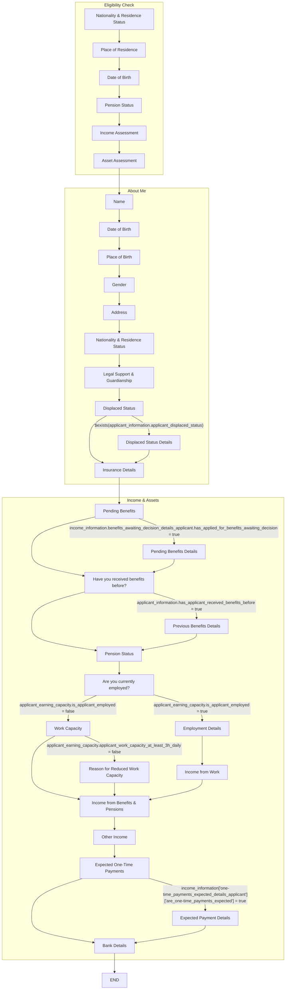

```mermaid
flowchart TD
    step_eligibility_nationality["Nationality & Residence Status"]
    step_eligibility_residence["Place of Residence"]
    step_eligibility_dob["Date of Birth"]
    step_eligibility_pension["Pension Status"]
    step_eligibility_income["Income Assessment"]
    step_eligibility_assets["Asset Assessment"]
    step_applicant_name["Name"]
    step_applicant_dob["Date of Birth"]
    step_applicant_place_of_birth["Place of Birth"]
    step_applicant_gender["Gender"]
    step_applicant_address["Address"]
    step_applicant_nationality["Nationality & Residence Status"]
    step_applicant_legal_support["Legal Support & Guardianship"]
    step_applicant_displaced_status["Displaced Status"]
    step_applicant_displaced_details["Displaced Status Details"]
    step_applicant_insurance["Insurance Details"]
    step_applicant_benefits_awaiting_decision["Pending Benefits"]
    step_applicant_benefits_awaiting_decision_details["Pending Benefits Details"]
    step_previous_benefits["Have you received benefits before?"]
    step_previous_benefits_details["Previous Benefits Details"]
    step_applicant_pension["Pension Status"]
    step_applicant_employment["Are you currently employed?"]
    step_applicant_employment_details["Employment Details"]
    step_applicant_work_capacity["Work Capacity"]
    step_applicant_work_capacity_reason["Reason for Reduced Work Capacity"]
    step_applicant_income_work["Income from Work"]
    step_applicant_income_benefits["Income from Benefits & Pensions"]
    step_applicant_income_other["Other Income"]
    step_applicant_expected_payments["Expected One-Time Payments"]
    step_applicant_expected_payments_details["Expected Payment Details"]
    step_applicant_bank_details["Bank Details"]
    step_eligibility_nationality --> step_eligibility_residence
    step_eligibility_residence --> step_eligibility_dob
    step_eligibility_dob --> step_eligibility_pension
    step_eligibility_pension --> step_eligibility_income
    step_eligibility_income --> step_eligibility_assets
    step_eligibility_assets --> step_applicant_name
    step_applicant_name --> step_applicant_dob
    step_applicant_dob --> step_applicant_place_of_birth
    step_applicant_place_of_birth --> step_applicant_gender
    step_applicant_gender --> step_applicant_address
    step_applicant_address --> step_applicant_nationality
    step_applicant_nationality --> step_applicant_legal_support
    step_applicant_legal_support --> step_applicant_displaced_status
    step_applicant_displaced_status -- "$exists(applicant_information.applicant_displaced_status)" --> step_applicant_displaced_details
    step_applicant_displaced_status --> step_applicant_insurance
    step_applicant_displaced_details --> step_applicant_insurance
    step_applicant_insurance --> step_applicant_benefits_awaiting_decision
    step_applicant_benefits_awaiting_decision -- "income_information.benefits_awaiting_decision_details_applicant.has_applied_for_benefits_awaiting_decision = true" --> step_applicant_benefits_awaiting_decision_details
    step_applicant_benefits_awaiting_decision --> step_previous_benefits
    step_applicant_benefits_awaiting_decision_details --> step_previous_benefits
    step_previous_benefits -- "applicant_information.has_applicant_received_benefits_before = true" --> step_previous_benefits_details
    step_previous_benefits --> step_applicant_pension
    step_previous_benefits_details --> step_applicant_pension
    step_applicant_pension --> step_applicant_employment
    step_applicant_employment -- "applicant_earning_capacity.is_applicant_employed = true" --> step_applicant_employment_details
    step_applicant_employment -- "applicant_earning_capacity.is_applicant_employed = false" --> step_applicant_work_capacity
    step_applicant_employment_details --> step_applicant_income_work
    step_applicant_work_capacity -- "applicant_earning_capacity.applicant_work_capacity_at_least_3h_daily = false" --> step_applicant_work_capacity_reason
    step_applicant_work_capacity --> step_applicant_income_benefits
    step_applicant_work_capacity_reason --> step_applicant_income_benefits
    step_applicant_income_work --> step_applicant_income_benefits
    step_applicant_income_benefits --> step_applicant_income_other
    step_applicant_income_other --> step_applicant_expected_payments
    step_applicant_expected_payments -- "income_information['one-time_payments_expected_details_applicant']['are_one-time_payments_expected'] = true" --> step_applicant_expected_payments_details
    step_applicant_expected_payments --> step_applicant_bank_details
    step_applicant_expected_payments_details --> step_applicant_bank_details
    step_applicant_bank_details --> END
    subgraph eligibility_check["Eligibility Check"]
        step_eligibility_nationality
        step_eligibility_residence
        step_eligibility_dob
        step_eligibility_pension
        step_eligibility_income
        step_eligibility_assets
    end
    subgraph applicant_information["About Me"]
        step_applicant_name
        step_applicant_dob
        step_applicant_place_of_birth
        step_applicant_gender
        step_applicant_address
        step_applicant_nationality
        step_applicant_legal_support
        step_applicant_displaced_status
        step_applicant_displaced_details
        step_applicant_legal_support
        step_applicant_insurance
    end
    subgraph applicant_financial_situation["Income & Assets"]
        step_previous_benefits
        step_previous_benefits_details
        step_applicant_benefits_awaiting_decision
        step_applicant_benefits_awaiting_decision_details
        step_applicant_pension
        step_applicant_employment
        step_applicant_employment_details
        step_applicant_work_capacity
        step_applicant_work_capacity_reason
        step_applicant_income_work
        step_applicant_income_benefits
        step_applicant_income_other
        step_applicant_expected_payments
        step_applicant_expected_payments_details
        step_applicant_bank_details
    end
```
